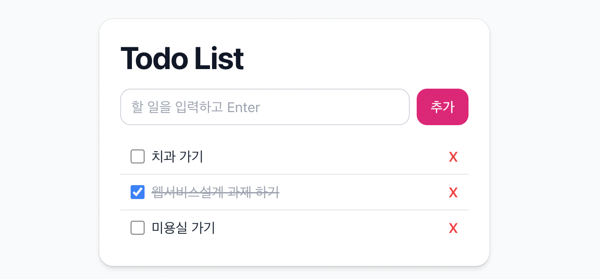

# Todo List

React + TypeScript + TailwindCSS 로 만든 간단한 TodoList 입니다.

---

## 👀 Preview


## 🔗 Live Demo
👉 [배포 페이지 바로가기](https://misosos.github.io/react-todo-ts/)

---

## 📦 기능
- 할 일 추가 (input form에 텍스트 입력 → Enter/추가 버튼)
- 완료 체크 (체크박스 토글 시 취소선 표시)
- 삭제 버튼(✕) 클릭 시 항목 제거

---

## ⚙️ 기술 스택
- **React**
- **Vite**
- **TypeScript**
- **TailwindCSS**
---

## 🚀 시작하기

1. 저장소를 클론합니다.
2. 의존성을 설치합니다.
   ```bash
   npm install
   ```
3. 개발 서버를 실행합니다.
   ```bash
   npm run dev
   ```
---
